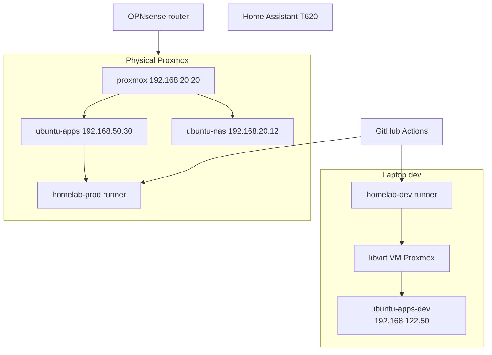

# Homelab v2 (greenfield)

Self-hosted homelab on Proxmox: Terraform + Ansible + Docker Compose, deployed via **GitHub Actions** with dual self-hosted runners.

| Branch | Environment | Effect |
|--------|-------------|--------|
| `homelab-v2` | **dev** | CI validate + deploy to dev VM (laptop libvirt) |
| `main` | **prod** | Terraform apply + app deploy on Proxmox (approval required) |

Legacy pre-v2 code is tagged `legacy-pre-v2` on `main` before merge (see greenfield plan).

## Knowledge base

Operator docs live under **[`docs/kb/`](docs/kb/)** — start there, do not duplicate them here.

| Topic | Page |
|-------|------|
| How it fits together | [architecture](docs/kb/architecture.md) · [infrastructure](docs/kb/infrastructure.md) · [networking](docs/kb/networking.md) |
| Run / deploy / login | [operations](docs/kb/operations.md) · [deployment](docs/kb/deployment.md) |
| Clean-room rebuild | [rebuild](docs/kb/rebuild.md) · [dr](docs/kb/dr.md) · [backup](docs/kb/backup.md) |
| Failures we already paid for | [lessons-learned](docs/kb/lessons-learned.md) · [troubleshooting](docs/kb/troubleshooting.md) |
| F9 audits (2026-09-10) | [security](docs/kb/security-audit-2026-09-10.md) · [repo](docs/kb/repo-audit-2026-09-10.md) · [rebuild drill](docs/kb/rebuild-drill-2026-09-10.md) |
| Per app | [docs/kb/apps/](docs/kb/apps/) |

## Architecture



## Repository layout

```
homelab/
  .github/workflows/     # CI/CD (self-hosted runners)
  ansible/               # VM configuration
  compose/core/          # Core Docker stack (Postgres, …)
  docs/                  # Manual setup, secrets names, app sources
  docs/kb/               # Operator knowledge base (F8) — start here
  opnsense/              # Router baseline (F2)
  homeassistant/         # HA config (F5)
  terraform/             # Proxmox VMs (TFC workspace homelab)
  utils/                 # Runner bootstrap, dev VM, secrets helper
```

## Prerequisites

First laptop / rebuild: [`docs/kb/rebuild.md`](docs/kb/rebuild.md) and [`docs/dev-proxmox.md`](docs/dev-proxmox.md). F0 sprint notes are historical: [`docs/manual-setup.md`](docs/manual-setup.md).

Tools: `git`, `gh`, `terraform`, `ansible`, `ansible-lint`, `docker`, `virsh`, `virt-install`, `openssl`.

## Secrets

Generate locally → **Bitwarden** `homelab/<NAME>/<env>` → `gh secret set`. Names only: [`docs/secrets-inventory.md`](docs/secrets-inventory.md).

App secrets: `utils/gen-app-credentials.sh` (not the older F1 `bootstrap-f1-secrets.sh`).

## Quick start — dev

1. Register dev runner: `utils/setup-github-runner.sh --label homelab-dev`
2. Nested Proxmox: [`docs/dev-proxmox.md`](docs/dev-proxmox.md) — `ensure-dev-proxmox.sh` + `bootstrap-dev-proxmox.sh`
3. Push to `homelab-v2` → `infra-plan-dev.yml` / `infra-apply-dev.yml` (Terraform IaC)
4. Apps: `apps-deploy-dev.yml` → `ubuntu-apps-dev` @ `192.168.122.50`

## Quick start — prod

Order (after F2–F3): OPNsense → Proxmox TF apply → Ansible → Compose. Prod workflows require:

- Self-hosted runner `homelab-prod` on `ubuntu-apps` (F3)
- TFC workspace `homelab` execution mode **Local**
- GitHub Environment **prod** approval on `main`

## CI/CD workflows

| Workflow | Trigger | Runner |
|----------|---------|--------|
| `ci-validate.yml` | push/PR `homelab-v2` | `homelab-dev` |
| `infra-plan-dev.yml` | PR/push `homelab-v2` | `homelab-dev` |
| `infra-apply-dev.yml` | push `homelab-v2` | `homelab-dev` |
| `apps-deploy-dev.yml` | push `homelab-v2` | `homelab-dev` |
| `infra-plan.yml` | PR → `main` | `homelab-prod` |
| `infra-apply-prod.yml` | push `main` | `homelab-prod` |
| `apps-deploy-prod.yml` | push `main` | `homelab-prod` |
| `tests-dev.yml` | after `apps-deploy-dev` / manual | `homelab-dev` |

Bootstrap: [`utils/setup-github-runner.sh`](utils/setup-github-runner.sh)

## Applications

P0/P1/P2 phases and sources: [`docs/apps-sources.md`](docs/apps-sources.md). Public app: `grocery.dkhomelabserver.xyz`.

Service endpoints (port, health path, expected status, container, priority) are declared once in [`config/services.yml`](config/services.yml); accounts and secret names in [`config/identities.yml`](config/identities.yml).

## Tests

```bash
utils/run-tests.sh --env dev --suite all
```

Suites (`smoke`, `infra`, `net`, `config`) are driven by `config/services.yml` — see [`tests/README.md`](tests/README.md). `SKIP` is not a failure, so the same command works while prod is still being built. F5 restore (`--suite restore`) is opt-in and not part of `--suite all`.

## Network

Prod Proxmox **`192.168.20.20`**; slots/VLANs: [docs/network.md](docs/network.md). Dev libvirt: `192.168.122.x`.  
WireGuard: [docs/wireguard.md](docs/wireguard.md). OPNsense F2: [docs/opnsense-baseline.md](docs/opnsense-baseline.md).

## Roadmap

| Phase | Scope |
|-------|--------|
| **F1–F8** | Done on `homelab-v2` (repo, DEV nested PVE, apps, identities, tests, KB) |
| **F9** | Audits written 2026-09-10 — **merge to `main` still FAIL** ([rebuild drill](docs/kb/rebuild-drill-2026-09-10.md)) |
| **F5** | NAS / NFS / backups — DEV loopback + timer + restore suite ([f5-storage](docs/f5-storage.md)). Prod disks / rclone / HAOS / vzdump still blocked on metal |
| **F3 metal / prod** | Physical Proxmox apply — not started |
| **F10** | Monitoring / alerts — after prod |

## Operations

See [`docs/kb/operations.md`](docs/kb/operations.md). Short version:

- Add an app: `config/services.yml` first, then compose, then `docs/kb/apps/<app>.md`
- Rotate a secret: `utils/gen-app-credentials.sh` → Bitwarden → bootstrap
- Logs: Dozzle `:8080`
- Logins: `~/.homelab-secrets/<env>/` — never the legacy `~/.homelab-*-dev-pass` files

## License

See [LICENSE](LICENSE).
