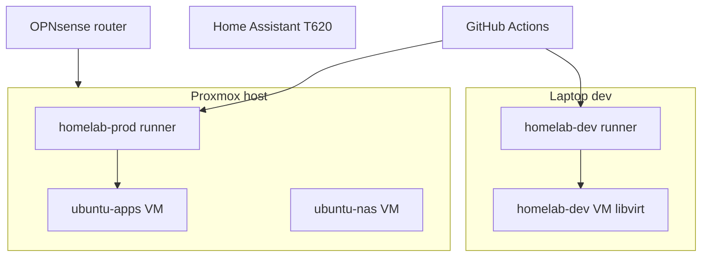

# Homelab v2 (greenfield)

Self-hosted homelab on Proxmox: Terraform + Ansible + Docker Compose, deployed via **GitHub Actions** with dual self-hosted runners.

| Branch | Environment | Effect |
|--------|-------------|--------|
| `homelab-v2` | **dev** | CI validate + deploy to dev VM (laptop libvirt) |
| `main` | **prod** | Terraform apply + app deploy on Proxmox (approval required) |

Legacy pre-v2 code is tagged `legacy-pre-v2` on `main` before merge (see greenfield plan).

## Architecture



## Repository layout

```
homelab/
  .github/workflows/     # CI/CD (self-hosted runners)
  ansible/               # VM configuration
  compose/core/          # Core Docker stack (Postgres, …)
  docs/                  # Manual setup, secrets names, app sources
  opnsense/              # Router baseline (F2)
  homeassistant/         # HA config (F5)
  terraform/             # Proxmox VMs (TFC workspace homelab)
  utils/                 # Runner bootstrap, dev VM, secrets helper
```

## Prerequisites

Local laptop setup (F0 sprint): [`docs/manual-setup.md`](docs/manual-setup.md)

Tools: `git`, `gh`, `terraform`, `ansible`, `ansible-lint`, `docker`, `virsh`, `virt-install`, `openssl`.

## Secrets

Generate locally → **Bitwarden** `homelab/<NAME>/<env>` → `gh secret set`. Names only: [`docs/secrets-inventory.md`](docs/secrets-inventory.md).

Helper script (F1): `utils/bootstrap-f1-secrets.sh` — does not print values.

## Quick start — dev

1. Register dev runner: `utils/setup-github-runner.sh --label homelab-dev`
2. Nested Proxmox: [`docs/dev-proxmox.md`](docs/dev-proxmox.md) — `ensure-dev-proxmox.sh` + `bootstrap-dev-proxmox.sh`
3. Push to `homelab-v2` → `infra-plan-dev.yml` / `infra-apply-dev.yml` (Terraform IaC)
4. Apps: `apps-deploy-dev.yml` → `ubuntu-apps-dev` @ `192.168.122.50`

## Quick start — prod

Order (after F2–F3): OPNsense → Proxmox TF apply → Ansible → Compose. Prod workflows require:

- Self-hosted runner `homelab-prod` on `ubuntu-apps` (F3)
- TFC workspace `homelab` execution mode **Local**
- GitHub Environment **prod** approval on `main`

## CI/CD workflows

| Workflow | Trigger | Runner |
|----------|---------|--------|
| `ci-validate.yml` | push/PR `homelab-v2` | `homelab-dev` |
| `infra-plan-dev.yml` | PR/push `homelab-v2` | `homelab-dev` |
| `infra-apply-dev.yml` | push `homelab-v2` | `homelab-dev` |
| `apps-deploy-dev.yml` | push `homelab-v2` | `homelab-dev` |
| `infra-plan.yml` | PR → `main` | `homelab-prod` |
| `infra-apply-prod.yml` | push `main` | `homelab-prod` |
| `apps-deploy-prod.yml` | push `main` | `homelab-prod` |

Bootstrap: [`utils/setup-github-runner.sh`](utils/setup-github-runner.sh)

## Applications

P0/P1/P2 phases and sources: [`docs/apps-sources.md`](docs/apps-sources.md). Public app: `grocery.dkhomelabserver.xyz`.

## Network

VLAN map, static IPs, and firewall notes: [docs/network.md](docs/network.md)  
WireGuard (VPN): [docs/wireguard.md](docs/wireguard.md)  
OPNsense F2 checklist: [docs/opnsense-baseline.md](docs/opnsense-baseline.md)  
UI walkthrough: [docs/opnsense-ui-walkthrough.md](docs/opnsense-ui-walkthrough.md)  
Verify: `utils/f2-verify.sh`

Public app: `grocery.dkhomelabserver.xyz`. Dev libvirt: `192.168.122.0/24`.

## Roadmap

| Phase | Scope |
|-------|--------|
| **F1** | Repo skeleton, CI, dev runner, dev VM, GH secrets (current) |
| **F2** | OPNsense baseline — [docs/opnsense-baseline.md](docs/opnsense-baseline.md), [docs/network.md](docs/network.md), [docs/wireguard.md](docs/wireguard.md) |
| **F3** | Proxmox Terraform, prod runner — [docs/f3-proxmox.md](docs/f3-proxmox.md), `utils/f3-verify.sh` |
| **F4** | P0 applications |
| **F5** | HA, backups, pCloud rclone |
| **F6** | P1/P2, monitoring, README completion before merge |

## Operations (TBD in F4–F6)

- Add app: Portainer Git deploy or `compose/core`
- Rotate secret: regenerate → Bitwarden → `gh secret set` → update inventory status
- Logs: Dozzle (F6)

## License

See [LICENSE](LICENSE).
